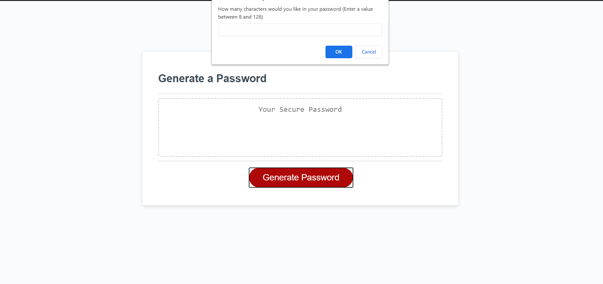
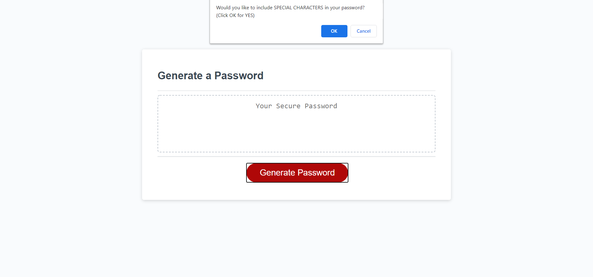
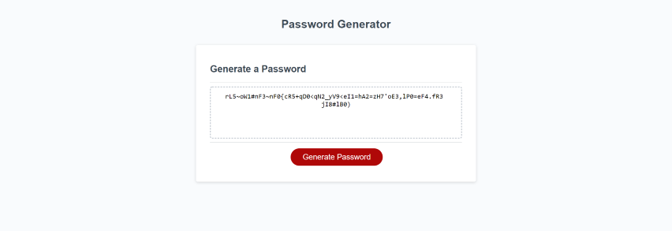

# random-password-generator

## Description
A lightweight application to generate a random password based on user-selected criteria.

##### Password Length View

##### Special Characters View

##### Generated Password View

Visit site [here](https://christopherconcannon.github.io/random-password-generator/)

## Table of Contents
  * [Installation](#installation)
  * [Usage](#usage)
  * [License](#license)
  * [Technologies](#technologies)
  * [Contributing](#contributing)
  * [Testing](#testing)
  * [Questions](#questions)
  
## Installation
Clone project to a directory on your local machine and cd into random-password-generator directory.  

## Usage
Open index.html file in your browser of choice and push the 'Generate Password' button.  Follow the prompts in the alerts to select you password criteria.  When password is generated copy and paste it to your desired location.

## License 
This project is covered under the MIT license 

## Technologies 
HTML5, CSS3, JavaScript

## Contributing
To see the guidelines adopted for contributing to this project, please view the [Contributor Covenant](https://www.contributor-covenant.org/version/2/0/code_of_conduct/code_of_conduct.txt)

## Testing
Tests coming soon

## Questions
Visit me at GitHub  
[christopherConcannon](https://github.com/christopherConcannon)
  
If you have any questions or would like to contact me, please email me at  
[cmcon@yahoo.com](mailto:cmcon@yahoo.com)
